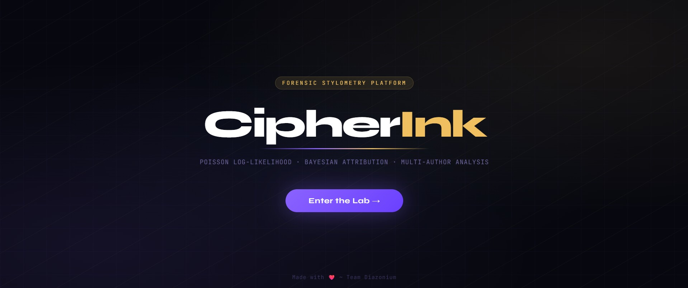
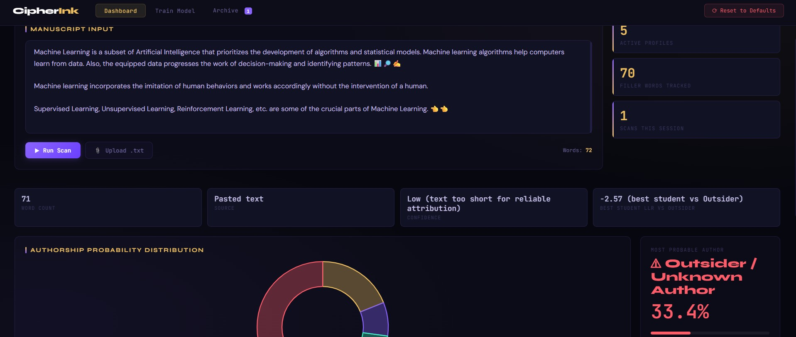

<div align="center">

# 🖋️ CipherInk
**Next-Gen Forensic Stylometry & Authorship Verification**

[](#)
[](#)
[](#)
<br>
[](https://utkarshbharadwaj.github.io/projects/cipherink.html)

*Poisson Log-Likelihood • Bayesian Attribution • Multi-Author Analysis*

</div>

---

## 📌 System Overview

> CipherInk is an advanced forensic stylometry platform for authorship verification. Powered by Bayesian techniques and a Poisson log likelihood backend, it analyzes linguistic fingerprints across 70+ markers to deliver real time, multi-author probability insights.

CipherInk is an evolution in text forensics. Moving beyond basic plagiarism checkers, it extracts deep linguistic patterns specifically analyzing high frequency, subconscious filler words to build highly accurate statistical fingerprints of writers. The platform provides a computational defense against identity misrepresentation and unverified text generation.

---

## ✨ Key Features

| Feature | Description |
| :--- | :--- |
| **Multi-Author Profiling** | Train custom Poisson models on established profiles alongside control corpora to generate baseline linguistic fingerprints. |
| **Real-time Manuscript Scanning** | Paste unverified text directly into the dashboard to instantly calculate the Log-Likelihood Ratio (LLR). |
| **Bayesian Probability Tracking** | Visualize confidence metrics and the most probable author via dynamic, real-time charts. |
| **Deep Forensic Breakdown** | Inspect the underlying math with a detailed matrix of expected vs. actual word counts and their log probabilities. |

---

## 🖥️ Platform Interface

### Enter the Lab
<div align="center">
  
</div>

### Manuscript Input & Scan Dashboard
<div align="center">
  
</div>

---

## 🛠️ Architecture & Tech Stack

CipherInk is structured to support a high-performance statistical backend paired with a modern, cybernetic web interface.

* **Backend:** Python 
* **Statistical Engine:** R (Statistical NLP & Feature Extraction)
* **Frontend:** React and Tailwind CSS
* **UI/UX Aesthetic:** Cybernetic dark mode utilizing glassmorphism and neon cyan accents for a futuristic laboratory feel.
* **Data Processing:** Poisson Distribution & Bayesian Models

---

## 🔬 The Science Behind CipherInk

CipherInk is heavily inspired by the foundational stylometry research detailed in *"Inference in an Authorship Problem"* by Mosteller and Wallace. Rather than analyzing context-dependent nouns or verbs, the system relies on the subconscious, highly frequent use of filler words (e.g., *'and'*, *'to'*, *'a'*, *'all'*). 

By modeling the frequency of these words using a Poisson distribution:

P(k) = (λ^k * e^-λ) / k!

where k is the actual number of occurrences in the text and λ is the expected frequency based on the author's trained profile, we extract the mathematical probability of authorship. We then apply Bayes' Theorem to update the probability of a specific author A given the observed text data B:

P(A|B) = [P(B|A) * P(A)] / P(B)

This allows the system to calculate the final Log-Likelihood Ratio (LLR), translating raw word counts into an undeniable mathematical footprint.

---

## 🚀 Getting Started

### Prerequisites
* Python 3.x
* R (installed and accessible in your system path)
* Git
* Node.js & npm (for the React frontend)

### Installation
1. **Clone the repository:**
   ```bash
   git clone [https://github.com/ananyajoshi-cseai/CipherInk.git](https://github.com/ananyajoshi-cseai/CipherInk.git)
   cd CipherInk
   ```
2. **Install Python dependencies:**
   ```bash
   pip install -r requirements.txt
   ```
3. **Install Frontend dependencies:**
   ```bash
   npm install
   ```
4. **Run the application:**
   ```bash
   python app.py
   npm start
   ```
## 👥 Engineered By

This project was engineered and designed by **Team Diazonium**:

* **Ananya Joshi** | *Indira Gandhi Delhi Technical University for Women (IGDTUW)*
* **Utkarsh Bharadwaj** | *Indian Statistical Institute (ISI) Delhi* – *Statistics, Mathematics, & Backend Architecture*

*Built for the Far Away Zuup Hackathon.*
